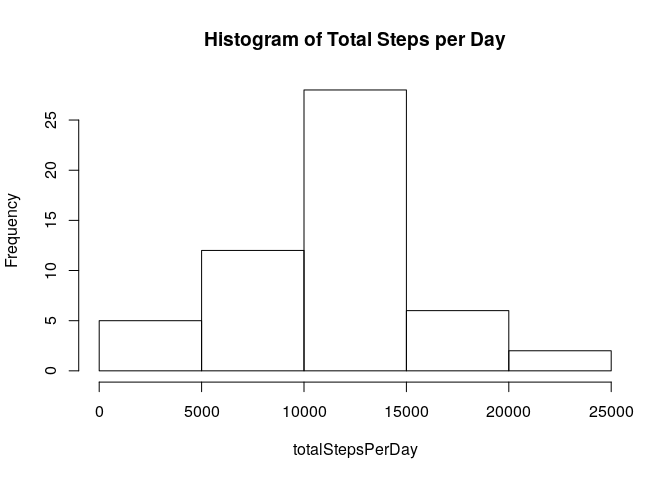
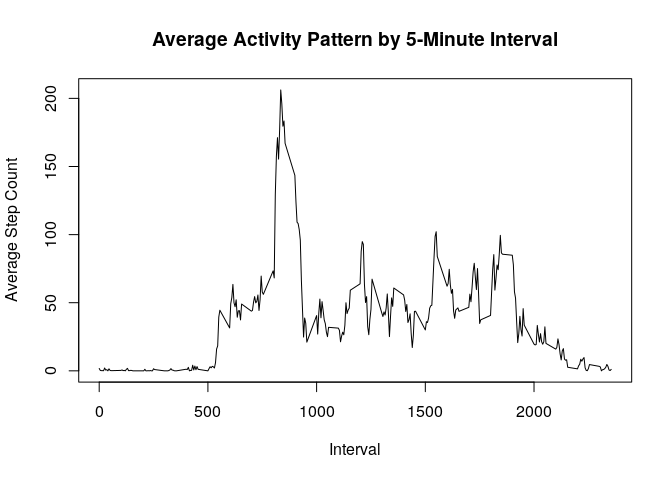
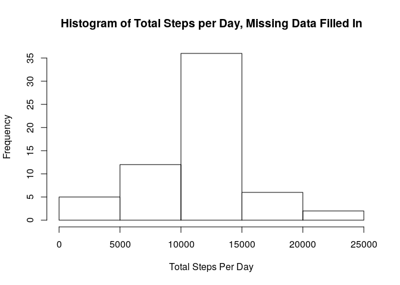
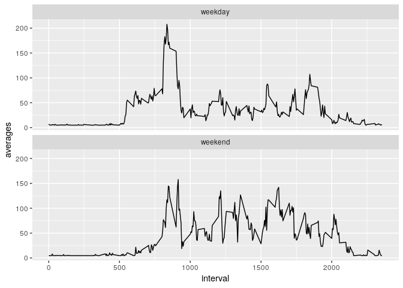

## Loading and preprocessing the data

```r
library(lubridate)
```

```
## 
## Attaching package: 'lubridate'
```

```
## The following object is masked from 'package:base':
## 
##     date
```

```r
library(ggplot2)
data <- read.csv(unz('activity.zip', 'activity.csv'))
data$date <- ymd(data$date)
removedMissingSteps <- data[!is.na(data$steps),]
```


## What is mean total number of steps taken per day?

```r
totalStepsPerDay <- tapply(removedMissingSteps$steps, removedMissingSteps$date, sum)

#Remove days without data
totalStepsPerDay <- totalStepsPerDay[!is.na(totalStepsPerDay)]

hist(totalStepsPerDay, main='Histogram of Total Steps per Day')
```

<!-- -->

```r
print(paste('Median of total steps is', median(totalStepsPerDay)))
```

```
## [1] "Median of total steps is 10765"
```

```r
print(paste('Mean of total steps is', mean(totalStepsPerDay)))
```

```
## [1] "Mean of total steps is 10766.1886792453"
```


## What is the average daily activity pattern?

```r
averagesByIntervals <- tapply(removedMissingSteps$steps, removedMissingSteps$interval, mean)
plot(names(averagesByIntervals), averagesByIntervals, type='l', main='Average Activity Pattern by 5-Minute Interval', xlab='Interval', ylab='Average Step Count')
```

<!-- -->

```r
maxValue <- max(averagesByIntervals)
maxInterval <- names(averagesByIntervals[averagesByIntervals == maxValue])
print(paste('The max time interval on average is', maxInterval))
```

```
## [1] "The max time interval on average is 835"
```


## Imputing missing values

```r
rowsWithNasBooleans <- !complete.cases(data)
missingCases <- sum(rowsWithNasBooleans)
print(paste('Number of rows with missing data is', missingCases))
```

```
## [1] "Number of rows with missing data is 2304"
```


```r
#going to impute missing data with the mean of all of the steps
meanOfStepsOverall <- mean(data$steps, na.rm=TRUE)
stepsFilledIn <- data$steps
stepsFilledIn[rowsWithNasBooleans] <- meanOfStepsOverall
stepsFilledInDf <- data
stepsFilledInDf$steps <- stepsFilledIn
totalStepsPerDay <- tapply(stepsFilledInDf$steps, stepsFilledInDf$date, sum)
```


```r
hist(totalStepsPerDay, main='Histogram of Total Steps per Day, Missing Data Filled In', xlab='Total Steps Per Day')
```

<!-- -->

```r
print(paste('Median of total steps is', median(totalStepsPerDay)))
```

```
## [1] "Median of total steps is 10766.1886792453"
```

```r
print(paste('Mean of total steps is', mean(totalStepsPerDay)))
```

```
## [1] "Mean of total steps is 10766.1886792453"
```

The values for mean and median slighlty differ in this section than the previous section.  In this section, the mean and median are closer together.

Additionally, imputing missing data has made the distribution of total steps per day have less variance.  There are more days with total steps close to the mean.  

## Are there differences in activity patterns between weekdays and weekends?

```r
stepsFilledInDf$weekend <- (weekdays(data$date) %in% c('Saturday', 'Sunday'))
stepsFilledInDf$weekday <- !stepsFilledInDf$weekend
weekendData <- stepsFilledInDf[stepsFilledInDf$weekend,]
weekdayData <- stepsFilledInDf[stepsFilledInDf$weekday,]
averagesByIntervalsWeekends <- tapply(weekendData$steps, weekendData$interval, mean)
averagesByIntervalsWeekdays <- tapply(weekdayData$steps, weekdayData$interval, mean)
averagesDfWeekdays <- data.frame(interval = as.integer(names(averagesByIntervalsWeekdays)), averages = averagesByIntervalsWeekdays, weekday = 'weekday')
averagesDfWeekends <- data.frame(interval = as.integer(names(averagesByIntervalsWeekends)), averages = averagesByIntervalsWeekends, weekday = 'weekend')
averagesDf <- rbind(averagesDfWeekdays, averagesDfWeekends)
ggplot(data = averagesDf, aes(x=interval, y=averages)) + geom_line(group=1) + facet_wrap(~weekday, nrow=2)
```

<!-- -->

